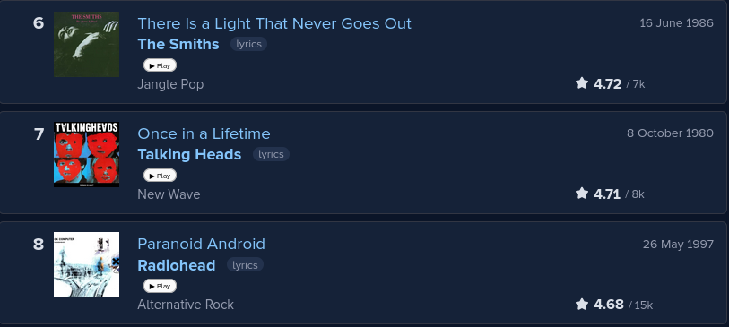

# rym-userscripts

Helpful userscripts for rateyourmusic.com (RYM).

## Getting started

1. Install a userscript manager (e.g., [Violentmonkey](https://violentmonkey.github.io/), Tampermonkey, or Greasemonkey).
2. Click any **Install** link below; your manager will prompt you to confirm.

## Scripts at a glance

| Script | What it does | Install |
| --- | --- | --- |
| `download-list.user.js` | Adds CSV and plain-text download buttons to any user list. | [Install](https://github.com/dbeley/rym-userscripts/raw/main/download-list.user.js) |
| `download-song-charts.user.js` | Exports song charts (CSV/plain text). | [Install](https://github.com/dbeley/rym-userscripts/raw/main/download-song-charts.user.js) |
| `download-album-charts.user.js` | Exports album charts (CSV/plain text). | [Install](https://github.com/dbeley/rym-userscripts/raw/main/download-album-charts.user.js) |
| `play-chart-songs.user.js` | Adds a play button that opens the first YouTube video for each chart entry. | [Install](https://github.com/dbeley/rym-userscripts/raw/main/play-chart-songs.user.js) |
| `retain-filters-on-chart-links.user.js` | Keeps your current genre/region filters when navigating chart links. | [Install](https://github.com/dbeley/rym-userscripts/raw/main/retain-filters-on-chart-links.user.js) |

## Script details

### download-list.user.js
- Adds buttons beside each RYM list to export it to CSV or plain-text list.
- Preserves ordering, list item titles, artists, release info, and notes where available.

### download-song-charts.user.js & download-album-charts.user.js

- Adds CSV and text export buttons above the chart.
- Includes artwork URLs, rating counts, genres, and release metadata.
- Tip: set RYM chart settings to show 100 rows per page to minimize paging.
- Scroll to the bottom once to load the album covers before exporting, otherwise you may see blank image fields.

### play-chart-songs.user.js
- Adds a `▶ Play` button to each song in a chart.
- Opens the first YouTube result automatically in a new tab.

### retain-filters-on-chart-links.user.js
- Ensures links to decades/subcharts keep your current filters (genres, descriptors, regions, etc.).
- Example: when browsing [top jazz albums](https://rateyourmusic.com/charts/top/album/all-time/g:jazz/), decade shortcuts now keep the `g:jazz` filter intact.

## Sample data

### Song charts

| title | artist | release_date | genre | average_rating | number_of_ratings | image_url |
| --- | --- | --- | --- | --- | --- | --- |
| A Day in the Life | The Beatles | 26 May 1967 | Art Rock | 4.74 | 6k | https://e.snmc.io/i/300/s/17e154620068ef6923a4fc7abbdfc3e8/10941490/The%20Beatles%20-%20Sgt_%20Pepper's%20Lonely%20Hearts%20Club%20Band%2C%20Cover%20art.jpeg |
| Helpless Child | Swans | 22 October 1996 | Post-Rock | 4.74 | 3k | https://e.snmc.io/i/300/s/742b19a60e882643737cdde408788ceb/1868623/Swans%20-%20Soundtracks%20for%20the%20Blind%2C%20Cover%20art.jpeg |
| Strawberry Fields Forever | The Beatles | 17 February 1967 | Psychedelic Pop | 4.73 | 5k | https://e.snmc.io/i/300/s/22b07b0f5428621d5952e23e7800022d/5770162/The%20Beatles%20-%20Magical%20Mystery%20Tour%2C%20Cover%20art.jpeg |
| There Is a Light That Never Goes Out | The Smiths | 16 June 1986 | Jangle Pop | 4.72 | 5k | https://e.snmc.io/i/300/s/21bcf64f8478a3bb189c5ebb8f326068/12056415/The%20Smiths%20-%20The%20Queen%20Is%20Dead%2C%20Cover%20art.png |

### Album charts

| title | artist | release_date | genres | average_rating | number_of_votes | number_of_reviews | image_url |
| --- | --- | --- | --- | --- | --- | --- | --- |
| To Pimp a Butterfly | Kendrick Lamar | 15 March 2015 | Conscious Hip Hop, West Coast Hip Hop, Jazz Rap, Political Hip Hop, Neo-Soul, Funk, Poetry, Experimental Hip Hop | 4.38 | 83k | 769 | https://e.snmc.io/i/300/s/24619d37493bde1cc35d160e31d170ae/8121875/Kendrick%20Lamar%20-%20To%20Pimp%20a%20Butterfly%2C%20Cover%20art.jpeg |
| OK Computer | Radiohead | 16 June 1997 | Alternative Rock, Art Rock, Post-Britpop, Space Rock Revival | 4.29 | 107k | 2k | https://e.snmc.io/i/300/s/4b89c6190a18ed4c06d8068c556a5f9e/11993756/Radiohead%20-%20OK%20Computer%2C%20Cover%20art.jpeg |
| In Rainbows | Radiohead | 10 October 2007 | Art Rock, Alternative Rock, Electronic, Dream Pop, Art Pop, Krautrock | 4.32 | 80k | 949 | https://e.snmc.io/i/300/s/9b1e5b9f0d61d7177b42c31fb881fdc7/5914164/Radiohead%20-%20In%20Rainbows%2C%20Cover%20art.jpeg |
| Wish You Were Here | Pink Floyd | 12 September 1975 | Progressive Rock, Art Rock, Space Rock, Psychedelic Rock | 4.34 | 74k | 1k | https://e.snmc.io/i/300/s/be389a69a7e6c54e4643f81fa57f3478/4184635/Pink%20Floyd%20-%20Wish%20You%20Were%20Here%2C%20Cover%20art.png |
