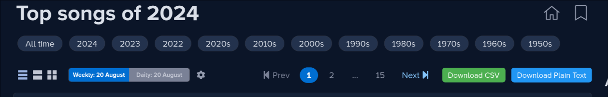

# rym-userscripts

Some userscripts for RateYourMusic.

- `song-charts.js`: add buttons to download song charts as CSV or plain text

- `album-charts.js`: add buttons to download album charts as CSV or plain text

> hint: you can configure RYM charts to display up to 100 elements at once

## Installation

- Install a userscript addon (I recommend [Violentmonkey](https://violentmonkey.github.io/))
- Install the userscript you want by clicking on the following links:
  - [song-charts.js](https://github.com/dbeley/rym-userscripts/raw/main/song-charts.js)
  - [album-charts.js](https://github.com/dbeley/rym-userscripts/raw/main/album-charts.js)

